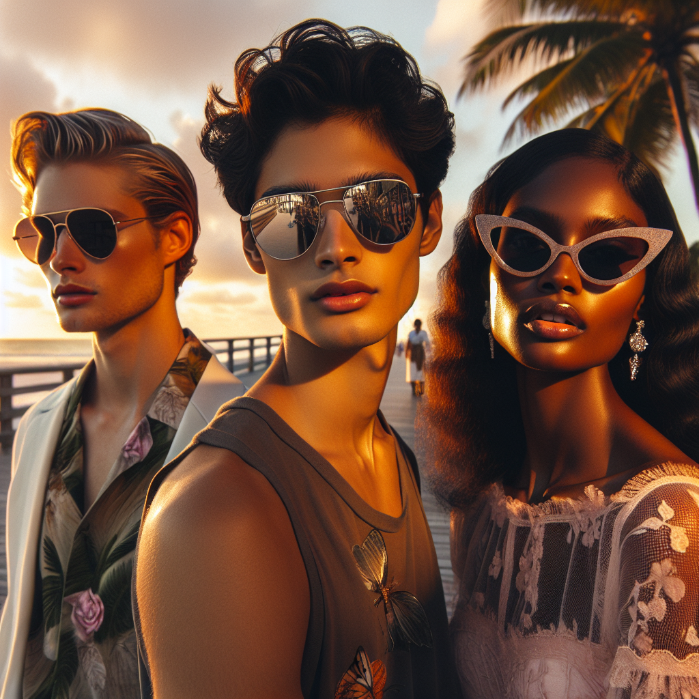

# 🕶️ Summer Sunglasses Campaign – Executive Summary

## 📊 Refined Trend Insights
Summer 2025 Sunglasses: Executive Trend Snapshot and Featured Styles  

1. Key Market Trends  
   • Aviator Revival  
     – Pilots-inspired teardrop frames are reemerging as a seasonal staple. Their classic unisex design and superior sun coverage deliver enduring appeal across demographics.  
   • Wayfarer Resurgence  
     – Bold, angular acetate frames—long favored by style icons—are experiencing renewed visibility both on and off the red carpet, marrying retro attitude with modern edge.  
   • Oversized Cat-Eye Silhouettes  
     – Dramatic, larger-than-life shapes channel a confident “more is more” summer ethos. The upswept 1950s–inspired profiles add instant glamour and high-fashion drama.  

2. Featured Catalog Picks  
   • SG001 “Aviator”  
     Why It Fits: Precisely captures the Aviator Revival trend. Ultra-light metal construction and full-coverage lenses ensure comfort and universality.  
   • SG002 “Wayfarer”  
     Why It Fits: Iconic structure meets contemporary relevance. The robust acetate frame projects a bold, summer-ready statement.  
   • SG003 “Mystique”  
     Why It Fits: Exemplifies the oversized cat-eye movement. Its elegant upsweep elevates any warm-weather ensemble with a touch of refined glamour.  

3. Strategic Rationale for Summer Campaign  
   • Broad Demographic Appeal: Together, these three silhouettes address men’s and women’s style preferences—from enduring classics to high-impact statements.  
   • On-Trend Positioning: Each style aligns directly with emerging “must-have” looks for Summer 2025, reinforcing our reputation as a forward-thinking brand.  
   • Inventory Confidence: All models are fully stocked and ready for multi-channel promotion, mitigating out-of-stock risk and supporting seamless launch execution.

## 🎯 Campaign Visual

    

## ✍️ Campaign Quote
Sunset Shades: Aviator, Wayfarer, Mystique in Perfect Harmony

## ✅ Why This Works
This phrase mirrors the image’s golden-hour setting and highlights the three key silhouettes—Aviator revival, chunky Wayfarer, upswept Mystique cat-eye—showcasing summer’s most on-trend, complementary looks in one elegant line.

---

*Report generated on 2025-10-08*
